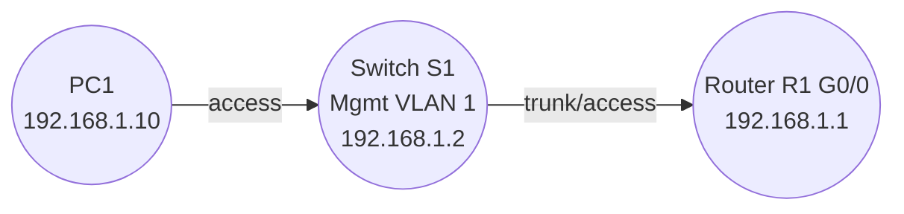

# Remote Management with Telnet and SSH Lab

Secure remote access is essential for managing network devices.  Early Cisco equipment supported **Telnet**, which transmits credentials and data in plain text.  Modern best practice is to use **SSH (Secure Shell)**, which encrypts the session.  This lab walks you through enabling both protocols on a router and switch, demonstrating the configuration commands and highlighting why SSH should be used in production.

## Topology

A router (R1) connects to a switch (S1), which in turn connects to a management PC (PC1).  The PC will initiate Telnet and SSH sessions to manage R1 and S1.

| Device | Interface | IP address |
| --- | --- | --- |
| **PC1** | NIC | 192.168.1.10/24 |
| **S1** | VLAN 1 | 192.168.1.2/24 |
| **R1** | Gig0/0 | 192.168.1.1/24 |

Default gateway for S1 is `192.168.1.1` (the router).  PC1’s default gateway can be set to the router as well.

### Mermaid diagram



## Tasks

1. **Build the topology.**  Place a router, a switch and a PC in Packet Tracer.  Connect PC1 to S1 (access port) and S1 to R1.  Assign IP addresses according to the table.
2. **Configure R1 for Telnet.**
   1. Create a privileged password and enable password encryption.
   2. Configure the VTY lines to accept Telnet:

      ```plaintext
      R1(config)# line vty 0 4
      R1(config-line)# password telnet_pass
      R1(config-line)# login
      R1(config-line)# transport input telnet
      ```

   3. At this point you can open a Telnet session from PC1 to `192.168.1.1` and log in using the password `telnet_pass`.  Note that all traffic is unencrypted.
3. **Configure R1 for SSH.**  Telnet will be replaced with SSH for security.
   1. Set a domain name and generate RSA keys (1024 or 2048 bits recommended):

      ```plaintext
      R1(config)# ip domain-name example.local
      R1(config)# crypto key generate rsa modulus 1024
      ```

   2. Create a local username with a strong password:

      ```plaintext
      R1(config)# username admin privilege 15 secret cisco123
      ```

   3. Configure the VTY lines to use local login and accept only SSH:

      ```plaintext
      R1(config)# line vty 0 4
      R1(config-line)# login local
      R1(config-line)# transport input ssh
      R1(config-line)# exit

      R1(config)# ip ssh version 2
      ```

   4. Verify that you can SSH to R1 from PC1 using the credentials `admin / cisco123`.  Telnet should no longer work.
4. **Configure S1 for SSH.**  Switches also support SSH management.  On S1, configure the management VLAN IP address, default gateway, domain name, RSA keys and VTY lines similar to the router.  Use a different username/password if desired.
5. **Disable Telnet completely.**  For improved security, ensure that `transport input` includes only `ssh` on all VTY lines.  You can optionally leave Telnet configured on a few lines for lab practice.

## Discussion

Telnet transmits credentials and traffic in clear text, making it susceptible to sniffing and man‑in‑the‑middle attacks.  SSH provides confidentiality and integrity via encryption and key exchange.  Cisco IOS requires a host name and domain name before generating RSA keys.  Once SSH is configured, you should disable Telnet to enforce secure management.

## Configuration files

Example configurations for R1 and S1 are provided in the [configs](configs/) directory.  Use them to quickly enable Telnet and SSH in your lab.  Remember to adjust usernames and passwords for your environment.
