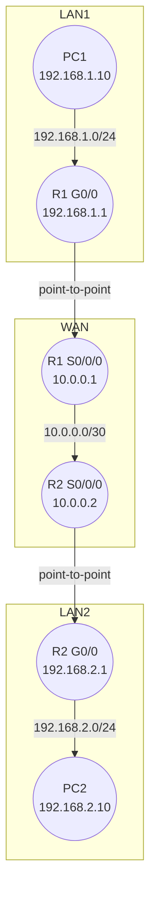

# Static Routing Lab

This lab teaches you how to configure static routes on Cisco routers so that devices on different networks can communicate.  Static routing is one of the simplest forwarding mechanisms: you manually define the next hop for each destination network.  While not scalable for large networks, static routes are ideal for small lab environments and are the foundation for understanding more complex routing protocols.

## Topology

Two routers (R1 and R2) are connected by a point‑to‑point serial link.  Each router connects to its own LAN with a PC.  The IP addressing plan is shown in the table below and visualised in the diagram.

| Device | Interface | IP address | Network |
| --- | --- | --- | --- |
| **PC1** | NIC | 192.168.1.10/24 | 192.168.1.0/24 |
| **R1** | Gig0/0 (LAN) | 192.168.1.1/24 | 192.168.1.0/24 |
| **R1** | Serial0/0/0 | 10.0.0.1/30 | 10.0.0.0/30 |
| **R2** | Serial0/0/0 | 10.0.0.2/30 | 10.0.0.0/30 |
| **R2** | Gig0/0 (LAN) | 192.168.2.1/24 | 192.168.2.0/24 |
| **PC2** | NIC | 192.168.2.10/24 | 192.168.2.0/24 |

### Mermaid diagram



## Tasks

1. **Build the topology.**  In Packet Tracer, add two routers (e.g. `2911` models), two switches (optional) and two PCs.  Connect the devices according to the diagram.  Use a serial `DCE` cable for the link between R1 and R2.
2. **Assign IP addresses.**  Configure the interfaces on R1 and R2 with the IP addresses from the table above.  Set the PCs’ IP addresses and default gateways (`192.168.1.1` and `192.168.2.1` respectively).
3. **Configure static routes.**  Without dynamic routing protocols, each router must know how to reach the remote LAN:
   - On **R1**, configure a static route pointing to R2 for the `192.168.2.0/24` network:

     ```plaintext
     R1(config)# ip route 192.168.2.0 255.255.255.0 10.0.0.2
     ```

   - On **R2**, configure a static route pointing to R1 for the `192.168.1.0/24` network:

     ```plaintext
     R2(config)# ip route 192.168.1.0 255.255.255.0 10.0.0.1
     ```

   These `ip route` commands specify the destination network, subnet mask and the next‑hop IP address and are taken from Cisco IOS configuration best practices【133835529857856†L100-L116】.

4. **Test connectivity.**  From PC1, ping PC2.  Initially the ping will fail until static routes are configured.  After configuring the routes, the ping should succeed.  Use the `show ip route` command on each router to verify that the static route is installed in the routing table.
5. **Optional:** Experiment with additional networks and static routes, or configure a default route using `ip route 0.0.0.0 0.0.0.0 <next‑hop>`.

## Configuration files

Sample configurations for both routers are available in the [configs](configs/) folder.  You can paste them directly into Packet Tracer’s CLI.
