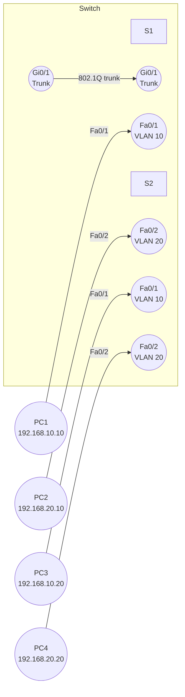

# VLAN and Trunking Lab

This lab introduces Virtual Local Area Networks (VLANs) and trunking.  VLANs allow you to segment a switch into multiple broadcast domains, improving security and reducing broadcast traffic.  Trunk ports carry multiple VLANs across a single physical link between switches, ensuring that VLANs span the campus.

In this scenario you will create two VLANs (`VLAN 10` and `VLAN 20`), assign switch ports to the appropriate VLANs, configure a trunk link between two switches, and verify that hosts in the same VLAN communicate across the switches.

## Topology

| Device | Interface | Purpose | VLAN |
| --- | --- | --- | --- |
| **PC1** | FastEthernet0 | Host in VLAN 10 on S1 | 10 |
| **PC2** | FastEthernet0 | Host in VLAN 20 on S1 | 20 |
| **S1** | Fa0/1 | Access port for PC1 | 10 |
| **S1** | Fa0/2 | Access port for PC2 | 20 |
| **S1** | Gig0/1 | Trunk to S2 | 10,20 |
| **S2** | Fa0/1 | Access port for PC3 | 10 |
| **S2** | Fa0/2 | Access port for PC4 | 20 |
| **S2** | Gig0/1 | Trunk to S1 | 10,20 |
| **PC3** | FastEthernet0 | Host in VLAN 10 on S2 | 10 |
| **PC4** | FastEthernet0 | Host in VLAN 20 on S2 | 20 |

### Mermaid diagram



IP addressing: assign `192.168.10.0/24` for VLAN 10 and `192.168.20.0/24` for VLAN 20.  Default gateways will be configured in the inter‑VLAN routing lab, but for this lab the PCs only need an IP address (gateway can be left blank).

## Tasks

1. **Build the topology.**  In Packet Tracer, add two layer‑2 switches (`2960`), four PCs and appropriate cables.  Connect PC1 and PC2 to S1’s access ports, and PC3 and PC4 to S2’s access ports.  Connect the switches using a crossover cable on Gig0/1.
2. **Create VLANs on both switches.**  Use the following commands to create and name the VLANs on each switch:

   ```plaintext
   Switch(config)# vlan 10
   Switch(config-vlan)# name Users_VLAN10
   Switch(config-vlan)# exit
   Switch(config)# vlan 20
   Switch(config-vlan)# name Users_VLAN20
   Switch(config-vlan)# exit
   ```

   Creating and naming VLANs helps you identify them later【45094192213535†L333-L358】.

3. **Assign access ports to VLANs.**  For each access port on S1 and S2, set the port to access mode and bind it to the correct VLAN.  This is done using the `switchport mode access` and `switchport access vlan` commands【45094192213535†L235-L273】.  Example for PC1’s port on S1:

   ```plaintext
   S1(config)# interface FastEthernet0/1
   S1(config-if)# switchport mode access
   S1(config-if)# switchport access vlan 10
   ```

   Repeat for the remaining ports (Fa0/2 on S1 to VLAN 20; Fa0/1 on S2 to VLAN 10; Fa0/2 on S2 to VLAN 20).

4. **Configure the trunk link.**  The link between S1 and S2 must carry multiple VLANs.  Use the following commands to set the ports to trunk mode and allow VLANs 10 and 20【45094192213535†L323-L327】:

   ```plaintext
   S1(config)# interface GigabitEthernet0/1
   S1(config-if)# switchport trunk encapsulation dot1q
   S1(config-if)# switchport mode trunk
   S1(config-if)# switchport trunk allowed vlan 10,20
   
   S2(config)# interface GigabitEthernet0/1
   S2(config-if)# switchport trunk encapsulation dot1q
   S2(config-if)# switchport mode trunk
   S2(config-if)# switchport trunk allowed vlan 10,20
   ```

5. **Assign IP addresses.**  Configure the PCs with IP addresses in their respective VLANs:
   - **VLAN 10:** PC1 `192.168.10.10/24`, PC3 `192.168.10.20/24`
   - **VLAN 20:** PC2 `192.168.20.10/24`, PC4 `192.168.20.20/24`
   Leave the default gateway blank for now.

6. **Test connectivity.**  From PC1, ping PC3.  The ping should succeed because both hosts are in VLAN 10 and the trunk passes VLAN 10 traffic.  Similarly, PC2 should be able to ping PC4.  Pings between VLANs should fail because there is no inter‑VLAN routing configured yet.

## Configuration files

Sample switch configurations for S1 and S2 are provided in the [configs](configs/) directory.  Apply them to your switches to speed up the lab.
